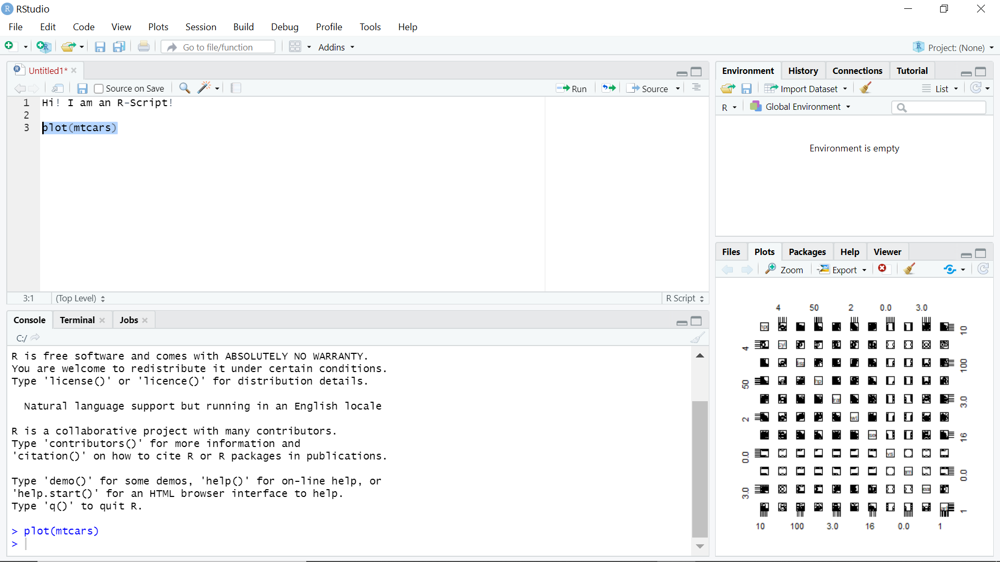

# Getting Started with R {#R}

```{r, include=FALSE}
knitr::opts_chunk$set(fig.align='center', message = FALSE)
```

```{r, echo = FALSE, fig.align='center', out.width="40%"}
library(knitr)
library(png)
include_graphics("images/Rlogo.png")
```

This chapter is designed to get R on your machine (Section 1), introduce you to some basic commands for data and variable manipulation (Section 2), and introduce you to some introductory data visualization (Section 3). We will also be using a companion software called Rstudio which will make our interaction with R much more pleasant.

After the basics are covered in this chapter, you should be able to go back to Chapter 2 and have a better understanding of some of the code there. We will be learning additional R commands as they become needed in the subsequent chapters. By the end of the course, you should have a pretty solid understanding of working your way around R.

Let's get started!

## The R Project for Statistical Computing

R is an open source (i.e. *free*) programming language and software environment for statistical computing, and is widely used among statisticians and data analysts.^[As of July 2020, R ranks 8th in the TIOBE index, a measure of popularity of programming languages.] It is similar to other programming languages you may have heard of before (e.g., Python), but R is more suited to our data analysis needs. However, once you get the hang of one programming language, it is easier to adopt subsequent languages.

In addition to using R, we will also be using RStudio. RStudio is an integrated development environment (IDE) for R. The desktop version of R studio is also free, and comes with many useful features. In fact, this course companion you are currently reading was entirely formatted in R studio.

This section will walk you through downloading, installing, and preparing R and RStudio for our purposes. Once this is accomplished, you should be able to replicate every application contained in this course companion by using the code contained in the gray boxes. Let us begin!

## Before you Install... RStudio Cloud?

Before venturing into downloading and installing R and RStudio, you should ask yourself a series of questions.

**Do you have a Chromebook?**
The following section is intended for installation on either a PC or a Mac. For those of you using Chromebooks (which uses a Linux operating system), you will not be able to install these programs unless you partition your hard drive to run purely in Linux. If you don't know what that means, then I don't suggest you go down that route.

**Do you have a rather old PC or old MAC?**
Installation of R and RStudio can be complicated on older computers. For example, if you have a PC with Windows 9 or earlier, you would need to download additional Microsoft programs to get R to install. If you have earlier MAC operating systems, you would need to install the specific version of R suitable for your OS.

**Are you planning to use a work computer with a high level of security?**
Work computers are commonly shielded from the outside world with rather strong security firewalls. Being open source, R likes to regularly communicate with a *Mirror* server (explained below), and computers with high levels of security tend to prevent this.

If you answered *yes* to any of the above questions (or if you simply do not feel like installing more software on your computer), then the solution for you is the RStudio Cloud.

The website is https://rstudio.cloud/

```{r, echo = FALSE, fig.align='center', out.width="75%", fig.cap = "Welcome to RStudio Cloud!"}
library(knitr)
library(jpeg)

```

Signing up for a free account with the RStudio Cloud has it's benefits...

1. You will be able to do everything for this class on the cloud-based version of the software without ever having to download anything.

2. Everything will be on your Cloud account, so any security firewalls will no longer be an issue.

3. You can run the most up-to-date version of R and RStudio no matter what operating system you have.

Of course, the RStudio Cloud also has a few drawbacks...

1. The RStudio Cloud requires an active internet connection when in use.

2. Your free account comes with limited usage time.^[At the time of this writing, the account comes with 25 hours per month. This may be subject to change.]  If you require more time, you are able to purchase additional usage time for a minimal fee.^[At the time of this writing, you can purchase an additional 50 hours of usage time for $5 per month. This may be subject to change.]

The bottom line is that the cloud-based version of RStudio is an excellent alternative to installing your own version of the course software. It is fairly new and prices are uncertain at the moment - and this is the only reason why this course has yet to *fully* adopt the cloud version for all students. Once prices have settled, this course will most likely shift to the cloud and no longer need students to install R and RStudio.

**Note:** If you decide to go with the RStudio option, you can skip the following section entitled *Downloading and installing R* and proceed to the section entitled *Taking Stock* and all remaining sections of the chapter. These sections are relevant for all students regardless of their version of RStudio.


## Downloading and installing R

This section is intended for students who are not going with the RStudio Cloud option discussed above, and are intending to download and install R and RStudio on your machine. Note that the directions below have you first downloading R and then RStudio. They are two separate programs that work together.

The first step to get R onto your machine is to go to the website, download the correct version of R, and install. 

The website is https://www.r-project.org/.

### Choosing a *Mirror*

Since R is open source, there are many different servers around the world where you can download it. You are welcome to choose any mirror (i.e., location) you wish, but you may want to be sure that you know the national language of whichever country you select. I was boring and simply chose a mirror in Pittsburgh, PA because it was closest to my location. 

### Download and install the correct version

R is available for PCs, Macs, and Linux systems. You will most likely want one of the first two options.^[While a Chromebook is technically a Linux system, you cannot install the software unless you partition the hard drive. This is why Chromebook users were directed to use the RStudio Cloud in the previous section.] Be sure to choose the option in the top box that offers *Precompiled binary distributions*.

**For Macs:** 

* Click on the "Download R for (Mac) OS X" link at the top of the page.

* Click on the file containing the latest version of R under "Files."

* Save the .pkg file, double-click it to open, and follow the installation instructions.

**For PCs:**

* Click on the "Download R for Windows" link at the top of the page.  

* Click on the "install R for the first time" link at the top of the page.

* Click "Download R for Windows" and save the executable file somewhere on your computer. Run the .exe file and follow the installation instructions.

Once this is complete, you will **never need to actually open R**. We will be using RStudio to communicate with R - and the next section directs you through the installation of RStudio.

### Downloading and installing RStudio

While R is open source, RStudio is a company that sells versions of its Integrated Digital Environment (IDE) to use along with R. In short, it is an easy-to-use interface that makes working with R easier. We will be using the free version of RStudio Desktop which is available here:

https://rstudio.com/products/rstudio/download/

**For Macs:**

* Click on "Download RStudio Desktop."

* Click on the version recommended for your system, or the latest Mac version, save the .dmg file on your computer 

* Double-click it to open, and then drag and drop it to your applications folder.

**For PCs:**

* Click on "Download RStudio Desktop."

* Click on the version recommended for your system, or the latest Windows version, and save the executable file.  

* Run the .exe file and follow the installation instructions. 

## Taking Stock

If you have either installed the software or signed up to the RStudio Cloud correctly, you should now be able to open Rstudio (or your Cloud account) and see a screen that looks like this:

```{r, echo = FALSE, fig.align='center', out.width="75%", fig.cap = "Welcome to R!"}
library(knitr)
library(jpeg)
include_graphics("images/Screenshot1.png")
```

The window on the left is your *Console* which is exactly what you would see if you opened up R directly.^[Note that we will never open R by itself, because it is easier to communicate with R through Rstudio.] The window on the upper-right is your *Global Environment*. It will show you all of the data sets, variables, and result objects that are currently in R and available to you. Note that it is currently empty because we haven't done anything yet. The window on your bottom-right has several useful tabs that let us look at our folder directory (as shown) as well as any figures we generate and R packages at our disposal. 

This is the default mode of Rstudio. You can input commands into the console right at the ">" and R will execute them line by line. This is fine if you wish to execute one single command at a time, but it becomes tedious if we have a series of commands we need to execute before we arrive at our desired result. We can therefore alter this default mode by adding R-scripts.

```{r, echo = FALSE, fig.align='center', out.width="75%", fig.cap = "An R-script!"}

```

Clicking on the green plus in the upper left of the screen will give you the option of opening an R-script. An R-script window will now appear and take up half of what was once our console space. An R-script is really nothing more than a text file. We can type several commands in sequence without running them line by line (which we would need to do if we typed them into the console). Once the commands are typed out, we can highlight them all and hit that run button on top. The commands get sent to the console and you're off...

```{r, echo = FALSE, fig.align='center', out.width="75%", fig.cap = "Running Commands from R-scripts!"}

```

The picture above is just a quick example of what an R-script can do. Line 3 tells R to plot all of the variables in a dataset called *mtcars*. Highlighting that line and hitting the run button sends the command to the console below, and the plot figure shows up in the Plots window. That's that!


## Coding Basics

Now that your software is ready to go, this section introduces you to how R likes to be talked to. Note that the subsequent chapters are full of commands that you will need to learn when the time comes. In the meantime, here are just a few general pointers.

R is what is known as a line command computing language - meaning that it doesn't need to compile code prior to execution. That being said, try the following command at the prompt in your console (>):

```{r}
12 + 4
```

See? Just a big calculator.

### Installing *Packages*

In order for R to be able to do some of the sophisticated things we will be doing in the course, we need to install source code called *packages*.

Whenever you need a package, all you need to do is type:

```
install.packages("name of package")
```

Once this is done, the package is installed in your version of R and you will never need to install it again.^[You need to do this for your Cloud-based version of R as well.] You will need to *unpack* the packages each time you want to use them by calling a *library* command, but we will get to that later.

The first R-script you will run as part of your first assignment is called *Install_Packages.R*. The executable portion of the code looks like this:

```
install.packages( c("AER", "car", "dplyr", 
"fastDummies", "readxl", "xtable", "vars",
"WDI", "xts", "zoo", "wooldridge") )
```
This is a simple command that asks R to download 11 packages and install them. You can easily make your own RScript by opening up a blank RScript in R, and copying the code in the gray box above.^[You can also get the code directly from the first assignment.] Highlight the portion above in your RScript, and hit the *Run* tab at the top of the upper-left window of RStudio. A bunch of notifications will appear on the R console (lower-left window) while the list of packages will be downloaded from the mirror site you selected earlier and installed. This can take some time (about 20 mins) depending on your internet connection, so it is advised you do this when you can leave your computer alone for awhile.

### Assigning Objects

We declare variable names and other data objects by *assigning* things names. For example, we can repeat the calculation above by first assigning some variables the same numbers:

```{r}
BIG <- 12
SMALL <- 4
(TOTAL <- BIG + SMALL)
```
Notice that all of these variable names should now be in your global environment (upper-right window). The reason why 16 was returned on the console is because we put the last command in parentheses. That is the *print to screen* command.

You might be asking why R simply doesn't use an equal sign in stead of the assign sign. The answer is that we will be assigning names to output objects that contain much more than a single number. Things like regression output is technically *assigned* a name, so we are simple being consistent. You can use an equal sign in place of the assign sign for some cases, and everything will go through equally well. However, this doesn't work for every command we will use in this class.

### Listing, Adding, and Removing

We can list all objects in our global environment using the list command: ls()

```{r}
ls()
```
As we already showed, we can add new variables by simply assigning names to our calculations.

```{r}
TOTAL.SQUARED <- TOTAL^2
```

If you ever wanted to remove some variables from your global environment, you can use the remove command: rm(*name of variable*)

```{r}
rm(TOTAL.SQUARED)
```

### Loading Data

R can handle data in almost any format imaginable. The main data format we will consider in this class is a trusty old MS Excel file. Note that there is a zip file associated with this companion that contains all data files needed for replication. You will need to download that zip file onto your computer and unzip it before proceeding. It is recommended that you put all of you data files somewhere easy to access. Like a single folder directly on your C drive.^[A folder on your *desktop* is the worst place for a data folder, because the file path is very messy. The closer to the C: drive, the better.]

There are two ways to load data...

**1. The Direct Way**

Once you locate a data file on your computer, you can direct R to import the file and assign it any name you want. The example below imports a dataset of automobile sales called AUTO_SA.xlsx and names it *CARDATA*.

```{r}
library(readxl)
CARDATA <- read_excel("data/AUTO_SA.xlsx")
```

The term *"data/AUTO_SA.xlsx"* is the exact location on my computer for this data file. Once you change the file path to your specification... you're done!

**2. The Indirect (but easy) Way**

You can also import data directly into R through Rstudio.

1. Use the files tab (bottom-right window) and locate the data file you want to import.

2. Left-click on file and select *Import Dataset...*

3. The import window opens and previews your data.

4. If everything looks good, hit *Import* and your done.

Note that the import window in step 3 has a *code preview* section which is actually writing the code needed to import the dataset. It will look exactly like what your code would need to look like in order to import data the direct way. You can refer to that for future reference.

### Manipulating Data

You should now have a dataset named *CARDATA* imported into your global environment. You can examine the names of the variables inside the dataset using the list command - only this time we reference the name of the dataset.

```{r}
ls(CARDATA)
```

When referencing a variable within a dataset, you must reference both the names of the dataset and variable so R knows where to get it. The syntax is:

Dataset$Variable

For example, if we reference the variable *AUTOSALE* by stating that it is in the CARDATA dataset.

CARDATA$AUTOSALE

We can now manipulate and store variables within the dataset by creating variables for what ever we need. For example, we can create a variable for real auto sales by dividing autosales by the consumer price index (CPI).

```{r}
CARDATA$RSALES <- CARDATA$AUTOSALE / CARDATA$CPI
ls(CARDATA)
```

### Subsetting Data

Sometimes our dataset will contain more information than we need. Let us narrow down our dataset to see how we can get rid of unwanted data. You should see a little Excel looking icon to the left of the name CARDATA up in the global environment window. If you click on it, you should see the following:

```{r, echo = FALSE, fig.align='center', out.width="75%", fig.cap = "A Dataset in R"}

```

Thinking of the data set as a matrix with 341 rows and 7 columns will help us understand the code needed to select specific portions of this data.

Note that the variable MONTH cycles from 1 to 12 indicating the months of the year. Suppose we only want to analyze the 12th month of each year (i.e., December). We can do this by creating a new dataset that keeps only the rows associated with the 12 month.

```{r}
CARDATA2 <- CARDATA[CARDATA$MONTH==12,]
```

What the above code does is treat the dataset CARDATA as a matrix and lists it as [rows,columns]. The rows instruction is to only keep rows where the month is 12. The columns instruction is left blank, because we want to keep all columns.

## Data Visualization

R is absolutely brilliant when it comes to data visualization, and this section will only scratch the surface of what it can do. We will go over some basic data visualizations using the built-in features of R. There are a lot of resources out there that covers a separate R package called ggplot. It's a handy package, but knowing the features discussed here will be sufficient for our course as well as give you some background that will help you push ggplot farther (if need be).

### Histograms

A histogram breaks data observations into bins (or breaks) and shows the frequency distribution of these bins. We will use this to consider probability distributions, but it also helps us get an idea of the distributional properties of any data sample.

Let us continue to analyze the car dataset we created above:

```{r}
hist(CARDATA$RSALES)
```

We can fancy this up by changing the title (main), labels (xlab), number of bins (breaks), and color (col). We will do this one at a time by creating a 2 by 2 set of figures using the par(mfrow=c(2,2)) command. This command *partitions* the plot window into a 2x2 series of subplots.

```{r}
par(mfrow=c(2,2))
hist(CARDATA$RSALES,main = "Real Auto Sales")
hist(CARDATA$RSALES,main = "Real Auto Sales",
     xlab = "Real Sales")
hist(CARDATA$RSALES,main = "Real Auto Sales",
     xlab = "Real Sales",
     breaks = 40)
hist(CARDATA$RSALES,main = "Real Auto Sales",
     xlab = "Real Sales",
     breaks = 40,
     col = "pink")
```

### Line, bar, and Scatter Plots

The plot command can visualize the relationship between two variables or just one variable in order. The barplot command is similar to a single-variable plot.

We can look at the nominal sales data in a line plot by specifying the type of plot as "l". A barplot delivers the same information, but just looks different.

```{r}
par(mfrow=c(2,1))
plot(CARDATA$AUTOSALE, type = "l")
barplot(CARDATA$AUTOSALE)
```

We can look at relationships using the default values of the plot command.

```{r}
plot(CARDATA$CPI,CARDATA$AUTOSALE)
```

You will see plenty of these plots throughout these notes, and they will get increasingly more sophisticated with titles, colors, etc.

### Boxplots

Box Plot illustrate the minimum, the 25th, 50th (median), 75th percentiles and the maximum. It is useful for visualizing the spread of the data.

```{r}
boxplot(CARDATA$AUTOSALE)
```

We can also examine these five numbers within groups according to some other variable. Lets look at this breakdown of auto sales per month of the year.

```{r}
boxplot(CARDATA$AUTOSALE~CARDATA$MONTH)
```

### Much more out there

While this basically covers most of the plots we will need for the course, there is a ton more out there. The interested reader can consult a *free* book on the matter.

https://rkabacoff.github.io/datavis/

However deep you want to go, I hope you have seen that data visualization in R is a heck of a lot easier than in Excel.^[For example, a histogram in MS Excel takes about 20 minutes for me to create each one!]